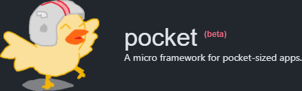

## Introduction

Pocket is a minimal state manager and push state router mushed together with some sugar on top. Use it together with your favorite view library.

## Poor Man's `create-react-app`

```sh
git clone https://github.com/whaaaley/pocket-demo.git && rm -rf .git && npm i
```

## Getting Started

Although not strictly nessecary, this framework was built with [Superfine](https://github.com/jorgebucaran/superfine) in mind.

```js
import { pocket } from 'pocket'
import { patch } from 'superfine'

const node = document.getElementById('app')
const app = init => pocket(init, view => patch(node, view))

const increment = state => ({ count: state.count++ })

const Home = {
  view: (state, dispatch) => {
    return (
      <div>
        <h1>Hello world!</h1>
        <button onclick={() => dispatch(increment)}>{count}</button>
      </div>
    )
  },
  onRoute: () => {
    console.log('Hello from the home page.')
  }
}

app({
  state: {
    count: 0
  },
  pages: {
    '/': Home
  }
})
```
